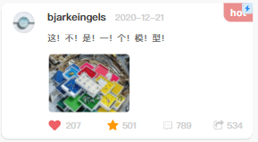

408研助手

## 概述

- 408研助手是一款主打计算机考研的信息交流与分享的小程序
- 通过小程序技术打造,具有跨平台的特点
- 以计算机 408 考研热门话题和经验分享为核心,形成 cs 研友相互分享相互帮助的实用的学习型兴趣社群主要的功能板块

### 论坛圈子

> 该板块可以细分
>$$
> - 经验帖子交流模块(加油站)
> - 专业问题求助
> - 复习规划

- 内容以用户的帖子和评论为主

  - 求助帖子的组成

    - 帖子上方为用户的头像和昵称
    - 中间为帖子的标题
    - 如果帖子中含有图片,则显示首个图片
    - 右下角提供回答按钮,其他用户可以点击并进行回答
    - 
  - 在每个帖子详情页面下方区域提供如下功能

    * 
    * 评论
    * 点赞计数
    * 收藏数
    * 分享帖子
    * 资料举报/标红警报
  - 发送帖子

    

    - 用户可以编辑文字附加图片

### 用户中心

用户登录

- 如果用户没有登录,显示登录页面

  - 登录完成后跳转到用户详情页
- 借助微信账号授权登录小程序
- 信息编辑/修改

  - 包括昵称修改
  - 密码修改
  - 年龄
  - 性别等
  - 
- 创作管理

  - 查看自己发布过的帖子
    - 我的经验
    - 我的求助
    - 我的回答
  - 删除自己发布的资料
- 收藏管理

  - 查看自己收藏的帖子
  - 取消收藏(删除)
- 小程序问题反馈

  > 该部分负责处理一下需求(可以使用同一套UI)
  >

  - 异常页面截图上传
  - 文本描述
  - 功能建议

## UI

### 共同UI

屏幕底部的导航栏由各个页面所共享

### 首页设计

- 可以考虑在上方放一个轮播图占位(内容可以是考研相关的新闻)

<!--
- 再接一个考试倒计时区域(数字手表的格式,精确到天)
  - 数字倒计时下方再安排一个可以自定义的标语(双击设置)
    - 可以自己输入内容
    - 可以由系统随机显示
  - 放置一个打卡按钮,按钮旁边能够显示累计打卡天数
  -->

- 目标院校专业
  - 左侧放置目标学校校徽,右侧用文字描述专业名称
  - 双击校徽,跳转到目标院校更改页面,可以修改目标
- 中间可以放个系统公告
- 然后可以再安排一些推荐的内容
  - 比如(考研视频推荐(b站/mooc))
  - 几个按钮跳转到本小程序的其他功能页面

    <!--<iframe src="https://modao.cc/app/IvfxFNWGr8gqndnEmNodwN/embed/v2" allowTransparency="true" frameborder="0"></iframe>
    \-->
