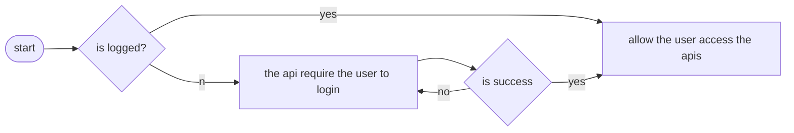

# 一、项目介绍 [徐超信,潘淼森]

## 背景


本项目旨在帮助用户记忆和熟悉大学阶段的英语词汇学习,解决日常的查词功能

- 当下的词典软件功能很丰富,但是高频使用的功能为数不多,
- 而且充斥着各种广告和产品推销
- 软件体积较大,运行开销不小,想要流畅的使用软件,需要用户有较好的设备
- 千方百计诱导用户充值vip,添加各种限制和不必要的信息,分散用户的精力
___
我们设计的这套英语学习系统,希望能够帮助用户更加轻松愉快的学习英语,包括:

- `cet4/cet6/考研英语`的词汇记忆学习/复习系统
- 用户可以分享自己对于词汇的记忆方法和技巧,互助学习
- 提供常规的词汇查询功能,用户可以通过输入英文单词来查询单词的基本信息(音标/词形/释义)
- 同时提供模糊查词的功能,帮助用户减轻查词过程中`摩擦感`
- 同时提供基本的形近词推荐,帮助用户集中记忆相似单词
- 记录用户的使用痕迹和习惯,帮助用户定制学习计划,检验学习效果,集中学习专注度,拒绝分心
___
## 项目需求分析

---

###  思维导图


思维导图1
总体的功能设计树
___

思维导图2:复习部分的细节设计树

___

### 首页

#### 欢迎

- 查词框(入口)
- 显示精美的轮播图
- 用户上次的科目以及对应的学习进度(进度条),诱导用户继续投入学习

___


#### 查词服务

- 查词详情内容:后端数据库直接提供词典

  - 音标

  - 词形(包括五种词形)

  - 解释

  - 用户查过的单词自动添加到查词记录中

  - 显示上一次学习的科目以及进度

​
___


### 学单词

- 记单词首页:

  - 用户可以选择科目进入学习(刷单词卡片)

  - 同时提供一个下拉框,可以选择学习模式


___


- 简洁模式

  - 常驻上方的模式`简洁模式/交流模式`点击开挂来切换学习模式

  - 常驻的进度提示:eg.`50/5514`

  - 单词卡片提供:

    - 单词拼写
    - 音标
    - 中文释义

  - 显示一个`单词详情`的查询按钮

  - 一个收藏按钮    
___


- 交流模式(引入其他用户的一些统计数据)

  - 基本和简洁模式一致,但包括:

  - 提供批注的发送和查看功能

  - 显示所有用户对该单词的平均掌握程度

    

___

 

### 提分助手(复习/测验)

- 该模块的菜单页包括
  - 头部显示当前的科目和学习进度(区别于复习)
  - 复习列表(复习策略)的选择
    - 最近学过的单词群
    - 所有熟练度不佳的单词
    - 当前词书内抽取单词(可作为总复习)(随机不重复)
  - 用户选择一种复习策略后,显示该策略的需要复习的词数
  - 提供四个题型的练习通道

___


#### 复习数据的生成&设计


- 用户初次学过一遍单词,可以复习&测验

  - 复习的内容的生成:(两级反馈复习队列)

    - 最近学过的内容(譬如指定时间24小时)
      - 如何判断时间:过去24小时见过的单词(刷卡片学习单词时会刷新相关属性,后端会完成响应操作)
    - 所有熟练度小于特定值的单词(该标准参考测验的答题情况,来量化熟练度)

___


- 测验:用户复习的形式是通过做测验题目来完成的

  - > 题目的交互形式主要交由前端来落实,而数据反馈会同步到后端

___


- 系统的答题模块提供了若干种题型

  - 根据中文意思选择单词
  - 根据音标以及意思提示拼写整个单词
  - 根据提示,为单词字母填空

- 如果用错答,那么系统会将该用户对于错单单词的熟练度值-1

- 如果用户正确答题,那么响应的将熟练度+1


___


- 提供学习规划:

  - 帮助用户规划每天学习的词汇数量,前端提供双向联动的学习计划设置入口.
    - 根据用户设定的每日任务计划数,计算出总耗时(天数)
    - 比如用户希望在多少天内完成,那么每天任务量是多少词,
  - 后台可以同步用户的计划设置(schedule)


___


### 我的

- 提供微信小程序的登录授权按你就,首先要求用户登录授权后继续使用

- 登录成功后显示

  - 用户昵称的基本信息

    - 用户户龄

    - 用户打卡累计天数和排行榜


___


- 用户考试倒计时功能
  - 用户输入考试时间,系统提示剩余时间倒计时

- 用户学习过程中累计的
  - 收藏列表
    - 收藏列表显示单词拼写
    - 用户在收藏列表中可以选择取消收藏
    - 用户点击单词,可以调转到单词解释详情页

  - 查词记录列表
    - 类似于收藏列表

- 提供小程序问题反馈功能
___
## 计划和分工

> 介绍大致的开发计划以及每个人的分工。

- 徐超信:
  - 原型设计和功能设计
  - 数据库设计
  - 后端开发接口开发与测试
  - 后端服务部署
  - 文档编写(主体)
___

- 潘淼森:
  - 前端小程序的开发与测试
  - 文档编写(前端)
___
# 二、界面原型设计 [徐超信]


> 结合上述功能设计,我们将原型设计为对应的四个模块,采用`墨刀工具进行设计`

___


## 首页


图2.1:首页操作

___


- 用户可以在首页提供的查词框中输入单词进行查词
- 查词框下面是一个轮播图,获取通过bing的图片接口,获取精美图片,为学习带来一点视觉上的享受
- 我们将单词的解释分为两层,第一层仅仅提供单词的音标和简单的解释,这一般能够满足主要的需求;此外,我们在第一层中配置了一个进一步查询单词的词形变化的按钮,点击该按钮,会跳转到第二层,这一层提供了更详细的解释,包括单词的词性等等
- 此外,还提供了收藏该的单词的按钮,点击该按钮,会将该单词添加到收藏列表中

___


**图2.2:继续复习**

- 轮播图下面安排了用户当前的学习科目和学习进度,用户点击继续学习,便可以进入学习模式
___


图2.3查词操作
___


- 对于拼写错误的单词,后台会尝试通过匹配算法推荐一些形近词
  - 对于记忆不清的单词来说,这会很有用,用户也可以利用该接口查找形近词
  - 事实上,后端可以提供正则匹配/通配符等高级功能(尽管已经很少用到了)


---

## 学单词


图2.4学单词操作流程
___

- 学单词模块,也就是本应用的核心模块
- 用户可以在该模块的主菜单页选择记忆模式(包括简洁模式和交流模式(也叫常规模式))
  - 默认的,记忆模式是常规模式
- 然后选择自己的考试类型(对应的词书)
- 其中,简洁模式包含内容弄个较少,只有音标和基本的解释,已经一个查询单词详情解释的按钮和收藏按钮
- 而另一个模式(交流模式中),除了包含简洁模式中的相关功能,还提供了基于后台数据分析的`所有用户平均熟练度指标`(也被称为`难度等级`)
- `我的观点`则是反映本人的当前对于该词汇的熟练度

___


图2.5收藏单词操作
___


- 这是用户点击单词详情和收藏后分别的出现的响应结果


图2.6交流模式下的批注操作
___

- 这是用户在交流模式下,提交自己的记忆技巧(简称为`批注`)
- 提交成功,则反馈一个`提交成功`的标识给用户

___
## 复习与测验


图2.7复习与测验操作流程1

___

- 复习&测验也是本应用的主要功能,能够帮助用户检查自己的记忆效果(掌握程度),帮助用户对自己的学习成果有更加客观的把握
- 我们提供了多样化的复习策略和题型,包括中文选词,拼写组合,拼写填空和全拼默写
- 对于答错的题目,页面会切换到正确答案的解释页面
- 对于答对的题目,页面会切换到下一题
- 注:问题提交答案的方式:
  - 用户选中一个选项后,(被自动提交),后台自动判断正确性,根据正确性切换对应的页面
  - 上述流程表示的是中文选词的答题过程

___


图2.8复习与测验操作流程2
- 这是拼写填空题型下的答题过程
___

## 我的


图2.9:我的主页

___

- 这是`我的(用户中心)`模块,用于借助于微信平台的登录授权功能方便的注册登录到本系统
  - 后台通过获取微信提供的信息头像和昵称的信息创建一个用户记录
  - 该记录也作为登录状态保持(session)的value
  - 后台将会凭借session来判断和区别用户
- 登录成功后,小程序拉取必要的同步数据,并且做一定的数据计算和转换,得到签到天数,户龄
- 还包括考试倒计时/单词收藏列表和查词记录/反馈与建议的提交入口

___


图2.10:我的主页2
___

- 用户点击我的->收藏列表,可以看到之前做过的单词收藏,(这些单词可能是用户自认为容易混淆意思/难以拼写/品读正确的单词)

- 用户点击某个条目后,可以跳转到响应的词典解释页面

- 用户点击星号`star`,可以取消掉对某个单词的收藏,程序会向用户发送一个确认询问,当用户确认取消,才真正将对应的单词从收藏列表中移除,否则,操作被取消

  

___


图2.11:我的主页3

- 这是进入`单词搜索记录`的流程,UI和操作逻辑基本和`收藏列表`一致
___

## 墨刀在线预览(可交互)

- https://modao.cc/app/Zq2TY5o8rd1a7cROgqSHwe 《EnglishLearningAsistant》 (页面附带多种状态)
- https://modao.cc/app/xg43top2raoiorN4gHVgF 《ELA_morePages》 
___
# 三、系统架构设计 [徐超信]

___
## 前端

- 前端我们分为四个功能模块
- 第一个模块是工具性模块,提供查词功能和形近词推荐功能
- 第二个模块是学单词模块(核心),并且具有两种模式可供选择,可以满足用户不同的学习风格
- 第三个模块是承接第二个模块,也是核心模块,用户可以复习和检测自己的学习效果;并提供了多样的复习策略和复习题型,也能更加全面的检测对单词的掌握情况
- 第四个模块是用户中心,属于不太常用但又不可或缺的模块,用户可以通过本模块获取自己的总体的学习情况和学习痕迹(打卡天数/收藏列表/查词记录列表/...),用户也是在该模块中反馈问题给程序后台
- 程序操作逻辑如下

___


图3.1:程序操作逻辑流图
___
## 后端

- > 后端对应前端,创建了4个功能模块,每个功能模块中在进一步细分

  - 为了实现灵活性,独立性,使用前后端分离的方式渐渐称为主流,本项目中,我们采用前后端分离的开发模式,并且借助于apifox做接口设计和对接,前后端可以有自己实际开发进度
  - 我们奉行`api first`的开发方式,促进前后端的进一步分离
- 后端采用Python/Django技术实现数据管理,用户登录与信息同步等功能
- 采用python mysqlclient模块来对接&管理mysql数据库
- 后端的各个模块内的基本结构(主要采用MVC设计模式来组织后端项目)
___

  - 根据我们选用的技术和设计模式,后端项目组织的基本规范如下(根据实际需求可以稍作调整)
  - ```python
    PS D:\repos\ELA\backEnd\user> lsd --tree --depth 1
     .
    ├──  __init__.py
    ├──  __pycache__
    ├──  admin.py
    ├──  apps.py
    ├──  loginMiddleware.py
    ├──  migrations
    ├──  models.py
    ├──  serializer.py
    ├──  tests
    ├──  tests.py
    ├──  urls.py
    └──  views
    
    ```
___

  - 下面解释一下各个文件和目录的作用
  - 其中admin.py作为注册后台模块管理的代码,用于管理后台的各个模块
  - apps.py向后端注册该Django应用,urls.py是该模块管理的子路由
  - Middleware.py作为中间件,用于登录验证/或者其他鉴权/自动处理
  - serializer.py是该模块使用DRF来数据模型的序列化和反序列化,可以在该文件中指定数据转化规则
  - tests目录中存放了该模块下的所有测试代码
  - views充当MVC中的Controller,负责存放和组织逻辑处理的代码文件
___
##  数据库
- 数据库采用免费的关系型数据库mysql,该数据库足够流行(意味着它经过了足够多的考验),完全可以胜任我们的本次项目
- 除了数据库软件本身的功能足够,我们本身已有的数据库知识也主要是关系型数据库的理论,因此最终采用mysql来提供数据管理服务
___
## api

> api设计是项目功能的重点,良好的接口设计有利于提高开发效率,节约沟通成本,提供可维护性

本项目的所有api都统一在apifox上设计,包括指定参数和响应,编写mock来实现前后端开发,借助于mock,前后端都有所参照,可以更加灵活的开发,项目的api总体符合restful的设计理念,具有简洁明了的特点

---

- 此外,后端还提供了基于swagger的文档,前端即使不查看后端代码,也可以对后端提供的接口有所了解

- `123.56.72.67:8000/doc/`局部api接口一览

- 图3.2:后端的swagger文档接口

___
# 四、API设计 [徐超信]

___

## api风格与设计理念

我们采用流行的RESTful api 设计风格,改善我们的api开发效率和规范性

- [RESTful API](https://en.wikipedia.org/wiki/Representational_state_transfer)是目前比较成熟的一套互联网应用程序的API设计理论。

  - > 访问一个网站，就代表了客户端和服务器的一个互动过程。在这个过程中，势必涉及到数据和状态的变化。
    >
    > 互联网通信协议HTTP协议，是一个无状态协议。这意味着，所有的状态都保存在服务器端。因此，**如果客户端想要操作服务器，必须通过某种手段，让服务器端发生"状态转化"（State Transfer）。而这种转化是建立在表现层之上的，所以就是"表现层状态转化"。**
    >
    > 客户端用到的手段，只能是HTTP协议。具体来说，就是HTTP协议里面，四个表示操作方式的动词：GET、POST、PUT、DELETE。它们分别对应四种基本操作：**GET用来获取资源，POST用来新建资源（也可以用于更新资源），PUT用来更新资源，DELETE用来删除资源。**

---

- 我们在开发项目的api的过程中,尽可能地采用RESTful理念,充分利用了http协议中的四个常用动词来设计api,客户端通过四个HTTP动词，对服务器端资源进行操作，实现"表现层状态转化"

- RESTful API最好做到Hypermedia，即返回结果中提供链接，连向其他API方法，使得用户不查文档，也知道下一步应该做什么。我们的后端的四个模块的基础路由提供了类似的功能,帮助api的使用者更快了解后端的api功能组织

  - 
  - 图:4.1

- 尽管RESTful 是一个很好的理念,但是在开发过程中,发现有少量的api较难通过四个动词来贴切地描述api的实际用意,因此,我们结合实际需求,对少数api做了折衷处理
___
##  详细的api文档

- 附件中的api文档是通过apifox导出,文件存放在github仓库中
- tables:[英语学习助手_api文档.md (github.com)](https://github.com/MaterialSharing/docs/blob/main/design/英语学习助手_api文档.md)
- swagger:[英语学习助手_api.html (github.com)](https://github.com/MaterialSharing/docs/blob/main/design/英语学习助手_api.html)

___
# 预览部分api文档
---

## GET 查询用户详情

GET /info/

如果不传入id,则查询所有用户

### 请求参数

| 名称   | 位置  | 类型    | 必选 | 说明                   |
| ------ | ----- | ------- | ---- | ---------------------- |
| page   | query | integer | 否   | 查看第几页数据         |
| size   | query | integer | 否   | 本次请求获取多少条记录 |
| search | query | string  | 否   | 支持正则搜索名字       |

> 返回示例

---

> 成功

```json
{
  "uid": 1,
  "nickname": "testNickname",
  "name": "Ronald Taylor",
  "signin": 28,
  "openid": null,
  "examtype": "6",
  "examdate": "2023-01-13",
  "signupdate": "1970-01-01"
}
```

---
api分页大数据集
```json
{
  "count": 152,
  "next": "http://127.0.0.1:8000/user/info/?page=2",
  "previous": null,
  "results": [
    {
      "uid": 13,
      "nickname": "testNickname",
      "name": "create_ser_pyt",
      "status": 0,
      "signin": 778,
      "openid": null,
      "examdate": "1970-01-01",
      "examtype": "4",
      "signupdate": "1970-01-01",
      "schedule": 30
    },

```

---

```json
 ......
    {
      "uid": 31,
      "nickname": "testNickname",
      "name": "create_ser_M_pyt",
      "status": 0,
      "signin": 8,
      "openid": null,
      "examdate": "1970-01-01",
      "examtype": "4",
      "signupdate": "1970-01-01",
      "schedule": 30
    }
  ]
}
```
### 返回结果

| 状态码 | 状态码含义                                              | 说明 | 数据模型 |
| ------ | ------------------------------------------------------- | ---- | -------- |
| 200    | [OK](https://tools.ietf.org/html/rfc7231#section-6.3.1) | 成功 | Inline   |

---

### 返回数据结构

状态码 **200**

| 名称          | 类型                | 必选  | 约束 | 中文名 | 说明 |
| ------------- | ------------------- | ----- | ---- | ------ | ---- |
| » data        | [User](#schemauser) | false | none |        | none |
| »» uid        | integer             | true  | none |        | none |
| »» name       | string              | true  | none |        | none |
| »» signin     | integer             | true  | none |        | none |
| »» examtype   | string              | true  | none |        | none |
| »» examdate   | string              | true  | none |        | none |
| »» signupdate | string              | true  | none |        | none |

---


## 持久化数据

- 本项目中,需要持久化的数据包括
  - 词典(单词的各个属性)
  - 三种考试科目考纲词汇列表
  - 用户信息
  - 用户的学习记录和学习情况
  - 用户的问题反馈记录
  - 用户的收藏
  - 用户的查词记录
  - 用户的评论记录(批注)
  - 等其他附加信息
___
## 数据库的选择

- 数据库方面,我们希望采用具有如下特点的数据库软件:
  - 当下流行的
  - 易用的
  - 参考资料丰富的
  - 免费的
  - 跨平台的
- 由于我们有关系型数据库的理论基础,对此会更加熟悉一些,因此我们考虑在关系型数据库中选择一款数据库软件
- 在具体选择数据库的时候,我们考虑过
  - postgre数据库(先进,功能完备,django首推的生产环境数据库)
  - mysql数据库(小巧,速度快)
- 两者都是可以免费使用,但基于资料的丰富程度,和现有的教程,我们选择了mysql
___
## ER关系图


图5.1 ER关系图
___
## 各个模块下的表设计

- 根据ER图表示上看,学习记录是一个多对多的关系,对于每个科目下都可以产生一个学习记录表
- 但是表的结构上看,如果每个科目一个表,那么就会有三张结构一致的表,这显得不那么有利于后台开发
- 所为了方便管理,我们将不同的科目不同用户的学习记录聚合到一张表上并且用一个字段examType来区分每条记录时属于哪个科目下的学习记录
- > 根据上述分析,我们创建了9张数据库表,下面举一个例子来描述
___
### 数据库表示例
#### words(词典/记单词模块)模块

##### 单词表

* 词典表

* ```sql
  +--------------------+--------------+------+-----+---------+----------------+
  | Field              | Type         | Null | Key | Default | Extra          |
  +--------------------+--------------+------+-----+---------+----------------+
  | wid                | int(11)      | NO   | PRI | NULL    | auto_increment |
  | spelling           | varchar(255) | NO   |     | NULL    |                |
  | phonetic           | varchar(255) | YES  |     | NULL    |                |
  | plurality          | varchar(255) | YES  |     | NULL    |                |
  | thirdpp            | varchar(255) | YES  |     | NULL    |                |
  | present_participle | varchar(255) | YES  |     | NULL    |                |
  | past_tense         | varchar(255) | YES  |     | NULL    |                |
  | past_participle    | varchar(255) | YES  |     | NULL    |                |
  | explains           | longtext     | YES  |     | NULL    |                |
  +--------------------+--------------+------+-----+---------+----------------+
  9 rows in set (0.32 sec)
  ```
  
  
---

- 字段描述:其中
  - wid作为主键,表示词汇序号
  - thirdpp为单词第三人称单数
  - past_tense为动词过去式
  - past_participle为动词过去分词
  - explains作为单词中文解释  
  
---

## 数据相关技术

- 我们采用django框架提供的ORM来操作数据,这使得后端代码的更加具有通用性,相对于编写原生的SQL语句,使用更加通用和专业的编程语言会更加开发上的有效率优势和维护优势
- 此外,django提供了强大的数据库迁移功能,当数据模型发生变化时,数据库迁移`migrations&migrate`操作可以将模型的修改同步反映到数据库表的修改
___

###  数据库迁移
- 数据库迁移的另一大好处是,可以和代码版本控制相互配合,实现整整的整个项目上的版本控制
- 当代码回滚到早期的版本是,数据库结构也需要回滚到相兼容的版本,否则项目可能直接无法运行起来
- 另一方面,django自带的ORM操作还比较初级,我们选用了基于Django的子框架DRF来提高数据库操作相关的编码效率和数据安全性检查,
- 特别是,对于大量数据查询操作返回的结果的分页功能的实现上,使用DRF会比原生的django分页更加合适前后端分离的项目
___
# 六、微信小程序端的实现 [潘淼森]

> 实现技术:vant app 组件+微信小程序
> 实现技术:vant app 组件+微信小程序


---

## 6.1 登录登出功能的实现
  
  
---

![[bg left:80% contain]](https://raw.githubusercontent.com/xuchaoxin1375/pictures/main/images%E5%B9%BB%E7%81%AF%E7%89%871.PNG)

图6.1
  
  
---

- 点击授权登录按钮，可以获取微信头像和昵称。
- 使用了微信官方文档的`API:wx.getUserProfile`实现授权登录功能。
- 登录前只能看到反馈建议和在线客服。
- 为了能够保持登录或者退出登录状态，用了微信官方文档API:wx.setStorageSync进行数据缓存，用wx.getStorageSync读取缓存。
- 申请获取头像和昵称
- 授权登录后可以看到累计打卡天数、ddl时间、我的收藏和历史记录。
- 点击"退出登录"按钮退出登录。
- 退出登录后看清空数据
  
  
---

## 6.2 查词功能的实现
  
  
---


图6.2
  
  
---

- 如果输入123，因为单词数据库中没有该内容因此显示未找到相关内容
- 如果输入一个正确的单词，然后回车或者点击搜索
- 显示单词、音标和释义。
- 如果单词没有变形，则不会显示单词变形内容。
- 如果搜索的单词有变形，则会显示单词变形内容。
- 单词变形内容包括：第三人称单数、复数、现在分词、过去式、过去分词等。
- 点击搜索框右侧的清除按钮，可以清空搜索框
- 点击查询历史右侧的垃圾桶图标，会提示是否清空历史记录。选择“是”，历史记录将被清空。

  
  
---


## 6.3 学单词功能的实现
  
  
---


图6.3.1
  
  
---

- 最上方是当前已背单词书/该词书单词总数。
- 中间是单词、音标、释义。如果没有单词变形则不显示，如果有则显示。
- 右滑实现翻页，翻到第一页再往前翻会提示
- 如果滑到第一页还左滑，那么会提示已经到第一个单词了
- 可以查看后端统计的难度等级
  
  
---


图6.3.2
  
  
---

- 点击“添加我的批注”按钮添加批注。
- 输入框会提示"分享你的想法..."。
- 如果输入框内容为空，则发表按钮被禁用；如果输入了内容，则发表按钮被启用。
- 点击发表按钮后，回到背单词页面。
- 发表批注后可以在批注区看到自己的微信头像、微信昵称和评论内容。
  
  
---


## 6.4 查考纲功能的实现
  
  
---


图6.4  
  
---


- 记忆模式可以切换四级大纲、六级大纲、考研大纲

- 选择相应的大纲后可以展示相应的大纲

  
  
---


## 6.5 计算ddl(deadline)功能的实现
  
  
---


图6.5  
  
---


- 点击日期可以切换考试日期。
- 如果还未选择考试日期，显示null天。
- 切换考试日期后自动计算ddl。
  
  
---

## 6.6 反馈建议&在线客服功能的实现
  
  
---


图6.6  
  

---

- 点击反馈建议可以反馈信息
- 点击在线客服可以与客服会话
  
  
---

# 七、英语助手后端的实现[徐超信]

> 这部分也是分模块来展示后端的实现方案。具体参见前面第六部分。

> 这部分分模块来描述后端的具体实现，比如：
___
## 7.1 查词功能的实现

> 这部分是用户管理模块，如登录、注册、修改等功能的具体实现。这里应该重点将实现时考虑的因素，使用的算法以及这样做的优缺点，最后可以通过界面的截图来展示实现效果。

___


- 查词功能是本程序的首页模块的功能,类似于词典
- 我们通过python+pandas从有道词典的接口爬取了13k单词,每个单词都具有
  - 中文释义
  - 音标
  - 5中词形(当然,名词没有过去式,动词没有复数,这种情况下都用NULL来填充字段)
  - 他们被存储在数据中,并通过ORM编写响应的查词接口,实现查词功能
___


图7.2.1:接口效果
___
## 7.2 学单词功能的实现

___


**图7.2.2**

___


- 学单词功能的实现,首先要获取对应科目的考纲词汇列表,由于列表很长,所以提供了分页功能
- 值得一提的是,后端几乎为所有返会长列表(大数据量)的操作提供了分页参数,因此不在每个接口地反复说明
- 实现本功能用到地接口原理也比较简单,获取考纲列表地接口通过读取对应的科目地词汇数据库表,将他们分页返回
- 在搭配一个刷单词时更新最近刷过(见过面的)卡片的时间(last_see_datetime),用以提供后面计算复习单词列表的基础数据
___
### 单词平均难度指数的实现

图7.2.3
- 该指标是通过计算数据库中所有用户对该单词的熟练度,并计算平均值,以此来计算单词的平均难度指数
- 可以帮助用户参考准确记忆该单词的难度
___
## 7.3 复习功能的实现

___


图7.3.1
- 用户通过指定科目,获取系统推荐的全书范围内的熟练度不佳的单词列表

___


图7.3.2

___


- 这是另一种复习模式:根据用户近期学习的词汇,提供复习列表
- 这里使用的是UTC时间,但是不影算法效果
- 客户端可以自行指定`最近`的概念,是最近1天还是最近1小时,甚至可以指定单位和浮点数
- 算法的基本原理比较简单,首先获取用户刷单词卡片的时候的时间(后端提供了响应的刷新时间的接口)
- 然后利用最近见过单词的时间和此时的时间(用户打开复习模块刷题的时刻)做时间差,当时间差处于指定范围内时,响应的记录就会被返回,用户生成复习列表
- 前端同样可以利用本接口开发丰富的复习模式,譬如允许用户输入时间范围.
___


- 图7.3.3


这是最后一种复习模式,用户可以将其作为抽查对全书范围内抽取的一组词汇检验,同样式借助于刷题来完成(原型设计中的四种题型)
___
## 7.4 模糊查词的实现

---

- 模糊查词(模糊匹配)的专业算法设计复杂的理论和推理知识,如果需要带有智能性,还需要人工智能技术来实现
- 本项目的匹配算法不具备智能性,但是也有一定的灵活性和实用性,具体的实现过程如下
  - django_实现朴素/基本模糊拼写候选/纠错
  - 使用到的拼写数据库支持(一角)


---


图7.4.1


- 计算单词字符集:`char_set`,计算该属性的目的是为了实现单词间字符构成的相似性匹配
- 处于现实效果的考虑,当用户输入的单词长度不超过4个字符时,我们只返回单词长度相同的并且字符构成一致的单词
---
- 对于较长的输入,我们会允许一定比例的字符误差(譬如8个字符串长度的输入,允许波动1~2个字符),这样可以匹配到一些字母记错,字母顺序错误的情况,此外,为了使得长度合理,还我还设置了长度波动范围(也是根据比例波动(譬如25%)),这样,可以匹配到比用户拼写的单词更短一些的词汇,这种情况发生的概率较小,但是不可以完全排除
- 后端还基于此开发了丰富的query参数,客户端可以以灵活的方式调用该接口,开发出多功能的查词功能
  - 比如,强制匹配前两个字母(startwith=2)
  - 强制匹配终结符(endwith=2)
  - 甚至,后台也提供了正则匹配的功能,但是这不太是本程序的重点目标,遂没有将前端实现出来

---


接口效果:
###  eg0:

图7.4.2
  
---

### eg1:


图7.4.3
  
---

###  eg2
`GEThttp://127.0.0.1:8000/word/fuzzy/fhather/1`

图7.4.3
  

___
## 7.5 用户中心
  
---

### 登录功能方案选型:

> [前端常见登录实现方案 + 单点登录方案 - 掘金 (juejin.cn)](https://juejin.cn/post/6933115003327217671)

- `Cookie + Session` 历史悠久，适合于简单的后端架构，需开发人员自己处理好安全问题。
- `Token` 方案对后端压力小，适合大型分布式的后端架构，但已分发出去的 `token` ，如果想收回权限，就不是很方便了。
- SSO 单点登录，适用于中大型企业，想要统一内部所有产品的登录方式的情况。
- OAuth 第三方登录，简单易用，对用户和开发者都友好，但第三方平台很多，需要选择合适自己的第三方登录平台。

> - 综合比较,我们选择第一种方案,比较符合项目定位
> - 利用session,后端可以充分利用用户的登录状态(从客户端提交过来的cookie中解析出用户信息从而帮助前端以更加简洁的参数就可以调用经过改进后的api)
> - 另一方面,提供身份认证为数据安全提供了基本保障,减少被攻击的可能
#### 登录流程


___
# 八、系统测试
  
---

## 8.1 单元测试


### 后端测试
  - 后端的测试采用django推荐的unittest来对代码进行测试
  - 在开发过程中,我们适当的使用TDD(测试驱动开发)的方式来编写了一部分api,并且认识到了TDD开发的优势
  - 编写测试需要花费一些实际,但是随着项目的体积的增长,依靠测试带来的便利就回来越显著,我们对自己的代码正确性也心中有底
---

- 在编写测试的时候,主要针对以下几个方面:
  - 路由和试图函数的映射是否正确
    - 在这里做测试是因为,随着项目规模的增大,我们的代码越来越复杂,对于每一个接口都要有响应的路由,这就发生后写的路由模式和之前已有的模式发生冲突,或者相互覆盖,导致api调用的时候数据传入到错误的函数中去处理
  - 编写关于视图函数的测试,这时候需要操作临时数据库,或者在测似乎代码中模拟出一些随机的或者特定的数据,总之应该使用能够达到检查目的数据  
---

- 利用APIfox 来测试接口
  - apifox也提供了简单易用的批量测试接口的功能,可以在线上环境中进行测试,也可以在本地进行测试,甚至支持多线程测试和并发测试,而且统计了接口的调用次数和调用时间,比较直观
  - 本项目在开发过程中就受益于批量测试,帮助我在部分接口缺少测试的时候及时发现问题并解决

#### coverage.py提供的测试覆盖率统计报告服务


图8.1通过coverage收集测试运行的信息(以项目中的word模块为例)
  

---


图8.2开始统计测试  
  
---


图8.3,总结当前的测试覆盖率(58%)  
  
---


## 8.2 集成测试集
* 成测试（Integration Testing），也叫组装测试或联合测试。在单元测试的基础上，将所有模块按照设计要求（如根据结构图）组装成为子系统或系统，进行集成测试

在本项目中,我利用apifox,我定义了若干有步骤之分的测试用例,每个测试用来中可以包含多个来自接口的请求示例,并且可以调整顺序,特别是在测试登录功能的时候,依赖于登录状态的api必须要放在登录后的接口后执行,依次地完对项目地4个模块的有序测试,所有接口,基本全部通过
  
  
---


图8.2.1通过apifox 进行的批量自动化测试,每个接口可以又多个测试实例
  
  
---


图8.2.2

- 这是通过apifox的套件测试,批量测试接口下的测试用例,并且测试保证顺序
- 报告测试结果

___

## 8.3 测试部署及结果  
  
---


图8.3.1再GitHub上部署并项目并且执行`Run Tests`,报告结果
  
---

* 我们利用github Actions 来执行自动化测试,主要的内容是,当我从本地将项目push到github上时,我们会自动运行测试,并且将测试结果发送到我的邮箱中,这样我们就可以更加方便的了解项目的测试结果,问题和故障可以及时的得到反馈,而不需要每次在本地跑一遍所有测试,可以节约时间
* 不仅如此,团队中的其他人也可以看到测试结果
___
# 九、系统部署 [徐超信]
___

## 自动部署

- 我们通过云主机来部署我们的项目,使得后台服务可以通过公网ip能够访问
- 我们有又利用github+webhook+github Actions实现持续继承和持续交付
- 云端可以及时自动的同步本地的最新项目成果,同时能够经过Actions的检查,依赖于本项目的其他成员就可以直到新的版本情况.
  
  
---
 

### 操作步骤

- 安装webbook

```bash
sudo apt-get install webhook
```
- 编写部署脚本deploy.sh:任务内容
  
---

```bash
# cxxu @ cxxuAli in ~/backEnd on git:main x [17:53:07]
$ cat deploy.sh
#! /bin/bash
cd ~/backEnd/
#git status
git pull origin main
echo `date`
echo '
```
  
---

  

- 编写hooks.json:

  - 注意,`execute-command`:是需要运行的脚本的路径(而不是命令,譬如source .deploy.sh)是不正确的

  - `command-working-directory` 是工作目录

    - 我在实验过程中,发现,当`deploy.sh`和工作目录在同一目录下,才生效
    - 此外,为了确保脚本的可用性和正确性,在正式使用前应该手动运行一下脚本文件(可以利用`chmod +x deploy.sh`赋予脚本可执行的权限)

  - ```json
    
    [
      {
        "id": "deploy",
        "execute-command": "./deploy.sh",
        "command-working-directory": "/home/cxxu/backEnd/"
      }
    ]
    ```
  
---

- 启动服务(临时性实验)

  - 进入到`hooks.json`所在目录中(或者指定hooks.json的绝对路径)

  - ```bash
     webhook -hooks hooks.json -verbose
    ```
  
---

- 实验webhooks连接

  - 用浏览器(或者其他可以发送http请求的客户端)发送get请求`http://123.56.72.67:9000/hooks/deploy/`

  - 这时候检查主机终端,如果能够捕获到请求,并且正确执行相关脚本,那么配置成功

    
  
---

- 配置github

  - 如果上述的服务启动可以正常运行,则将上述链接添加到githhub项目仓库的webhook中(settings->webhook)

- 长期运行

  - 将webhook的输出内容重定向到log.txt文件中.

  - ```bash
     nohup webhook -hooks hooks.json -verbose >log.txt &
    ```

  - 将所有输出(包括错误输出重定向到一个文件中)

  - ```bash
    $ nohup webhook -hooks hooks.json -verbose >log.txt 2>&1 &
    [1] 29968
    
    ```

   
---
   

> 利用github+webhook,实现基本的自动部署

图:github&webhook
  
---

- 查看输出日志

  - ```bash
    # cxxu @ cxxuAli in ~/backEnd on git:main x [18:04:52]
    $ cat log.txt
    [webhook] 2022/06/06 16:44:39 version 2.5.0 starting
    [webhook] 2022/06/06 16:44:39 setting up os signal watcher
    [webhook] 2022/06/06 16:44:39 attempting to load hooks from hooks.json
    [webhook] 2022/06/06 16:44:39 found 1 hook(s) in file
    [webhook] 2022/06/06 16:44:39   loaded: deploy
    [webhook] 2022/06/06 16:44:39 serving hooks on http://0.0.0.0:9000/hooks/{id}
    ```

___
# 十、功能展示 [潘淼森]

> 授权登录与退出


___
> 查词


___
> 背单词，左右滑动实现翻页


___
> 发表批注


___
> 难度评价


___
> 切换考纲


___
> 计算ddl


___
> 反馈与客服


___


# 十一、清单 [徐超信,潘淼森]
* 项目github(组织):[MaterialSharing (github.com)](https://github.com/MaterialSharing)
> 这部分列出项目提交的清单，如：
>
> - 前端代码: Front-End
> - 后端代码: backEnd
> - 原型设计文件: docs/design/design_原型操作逻辑1.pptx
> - 项目演示视频: docs/video.mp4
> - 各种流图和思维导图文件: docs/design/
  
---


# 十二、总结 [徐超信,潘淼森]

> 项目的总结，整个项目的感受以及下一步的计划。

[version control - How do I force "git pull" to overwrite local files? - Stack Overflow](https://stackoverflow.com/questions/1125968/how-do-i-force-git-pull-to-overwrite-local-files)

在开发本项目的过程中,我们收获了很多

- 学习,了解并实践了当下流行的开发技术,体验了规范的和相对完善的开发流程
- 培养了我们的主动学习能力,思考能力以及动手能力,为我们今后的工作学习打下了重要的基础
  
---

在开发过程中,我们同样遇到了各种问题

- 由于缺乏产品设计经验以及实战开发经验,我们小组在项目之初进度就较为落后,我们深刻的认识到,需求设计和架构设计一点也不能轻视,轻则拖慢项目开发进展,重则推导重来.
- 小组成员合理分工,沟通协商,团结一致也是分重要,不合理的分工会导致矛盾,缺乏沟通也会导致组内矛盾,影响开发效率和进度,而不团结的队伍也不利于项目的完善
- 此外还有进度安排不签当的任务复杂度估计往往会导致项目开发无法及时完成或者流程不够完善.
  
---

# 十三、参考文献 [徐超信,潘淼森]

> 系统所参考的文献或者代码，比如：
>
> - django4:[ Django: The web framework for perfectionists with deadlines https://www.djangoproject.com (google.com)](https://www.google.com/url?sa=t&rct=j&q=&esrc=s&source=web&cd=&cad=rja&uact=8&ved=2ahUKEwiYp9yJ2__3AhW6qVYBHS0TCZgQFnoECBUQAQ&url=https%3A%2F%2Fwww.djangoproject.com%2F&usg=AOvVaw3E6qaJashVeeIx3oahQxD7)
> - Django Rest framework:[ Django REST framework: Home https://www.django-rest-framework.org (google.com)](https://www.google.com/url?sa=t&rct=j&q=&esrc=s&source=web&cd=&cad=rja&uact=8&ved=2ahUKEwi7qJ-Y2__3AhUepVYBHbjiAPEQFnoECAcQAQ&url=https%3A%2F%2Fwww.django-rest-framework.org%2F&usg=AOvVaw0ZGmLSXHw1XKCvqteVn5f-)
> - mysql8:[MySQL :: MySQL 8.0 Reference Manual](https://dev.mysql.com/doc/refman/8.0/en/)
> - wechat 小程序开发文档:[微信开放文档 (qq.com)](https://developers.weixin.qq.com/miniprogram/dev/framework/)
> - vant3:[Vant 3 - 轻量、可靠的移动端组件库 (youzan.github.io)](https://youzan.github.io/vant/#/zh-CN)
> - uni-app: https://uniapp.dcloud.io/ 
> - [version control - How do I force "git pull" to overwrite local files? - Stack Overflow](https://stackoverflow.com/questions/1125968/how-do-i-force-git-pull-to-overwrite-local-files)


